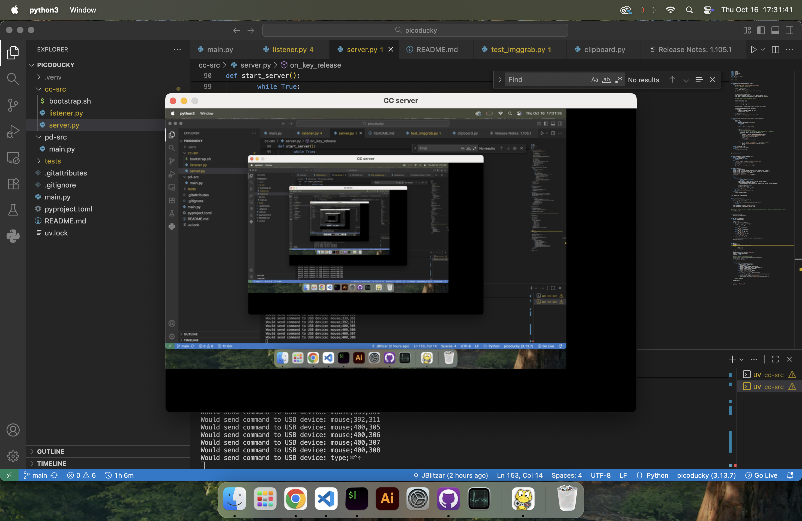

# picoducky



> demo / working code incoming when I actually have hardware to run this on

Remote control server with Picoducky. What this means is you're able to remotely control your computer from somewhere else just by plugging this in, without any external permissions!

But it requires a bit of gymnastics to get there. The picoducky doesn't have wireless, but you can just use the computer's wireless connection to communicate with the server. But how to relay information from there? Well, it turns out you can advertise as a composite device: Namely a keyboard AND a usb serial at the same time. So you can just communicate code from there. You can essentially run arbitrary code on the computer because you could just type in terminal `curl | sh`. Screenshotting the whole screen usually requires elevated permissions too, but in this case, with keyboard access, you can just spam the screenshot hotkey.

## To test (for now)

> mac only for now

`git clone`, `cd` in, etc etc

```bash
uv sync
cd cc-src
uv run server.py
uv run listener.py # in another terminal window
```

Then press cmd + ctrl + shift + 3 to see the screenshot propogate

## (UNTESTED) Install on Pico (CircuitPython)

1. Hold the BOOT button while plugging in the board
2. Download and drag-and-drop the .uf2 file from [CircuitPython](https://circuitpython.org/board/raspberry_pi_pico/)
3. Press the RESET button or replug the USB cable
4. Download the Adafruit CircuitPython bundle from [here](https://circuitpython.org/libraries)
5. Extract the bundle and locate the adafruit-hid folder inside the lib directory
6. Copy the adafruit-hid folder to the CIRCUITPY lib directory
7. Copy the file mouse_abs.py from this repo to the CIRCUITPY drive in /lib/adafruit_hid
8. Copy `pd-src/boot.py` to `CIRCUITPY/boot.py` and `pd-src/code.py` to `CIRCUITPY/code.py`.
9. Press the RESET button or replug the USB cable
10. You're all set!

On button press it should install the bootstrap script

Current client-server hosting is just done on 127.0.0.1. Change this and the url of your bootstrap script if you want something else.
